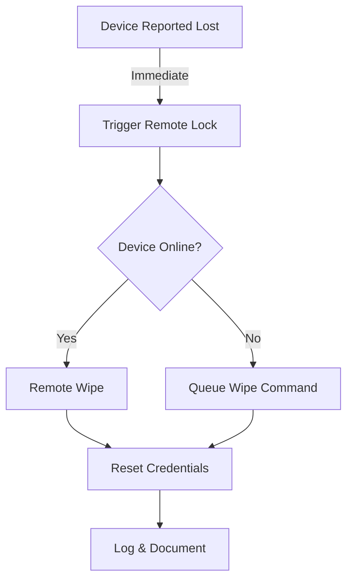

# Mobile Device Security Implementation Solution

## 1. Quick Start Implementation

### Immediate Actions (24-48 Hours)
```bash
# Priority 1: Device Inventory & Classification
1. Run network scan to identify all connected devices
2. Tag devices: CRITICAL, HIGH, MEDIUM, LOW
3. Force re-authentication for all mobile devices

# Priority 2: Deploy Basic Security Controls
1. Enable encryption
2. Enforce password policies
3. Deploy MDM certificates
```

## 2. Core Security Solutions

### 2.1 Encryption Implementation
```yaml
Required_Encryption:
  Device_Storage:
    iOS: 
      - Enable FileVault (automatic)
      - Verify: Settings > Face ID & Passcode > Data protection is enabled
    Android:
      - Enable default encryption
      - Verify: Settings > Security > Encryption
    
  Communications:
    VPN: 
      Protocol: IKEv2
      Encryption: AES-256-GCM
      Authentication: Certificate-based
    Email: 
      Protocol: TLS 1.3
      Encryption: S/MIME
```

### 2.2 MDM Fast Deployment
```json
{
  "mdm_profile": {
    "basic_security": {
      "screen_lock": "required",
      "lock_timeout": "5_minutes",
      "min_passcode_length": 8,
      "encryption": "forced_on",
      "biometrics": "allowed_with_fallback"
    },
    "app_control": {
      "app_store": "restricted",
      "side_loading": "blocked",
      "minimum_os": {
        "ios": "15.0",
        "android": "12.0"
      }
    }
  }
}
```

### 2.3 CIS Benchmark Quick Implementation

```yaml
CIS_Controls:
  Level_1_Critical:
    - Enable auto-updates
    - Block unknown sources
    - Enforce device encryption
    - Enable remote wipe
    - Block jailbroken/rooted devices

  Level_2_Enhanced:
    - Configure app permissions
    - Enable security logging
    - Implement backup encryption
    - Control cloud services access
```

## 3. Automated Compliance Checks

### 3.1 Daily Automated Checks
```python
daily_checks = {
    'encryption_status': True,
    'password_compliance': True,
    'os_version': 'current-1',
    'security_patches': 'latest',
    'unauthorized_apps': None
}

alerts = {
    'critical': 'immediate',
    'high': '4_hours',
    'medium': '24_hours',
    'low': '72_hours'
}
```

### 3.2 Compliance Monitoring Script
```bash
#!/bin/bash
# Run daily at 00:01

# Check device encryption
check_encryption() {
    for device in $(get_device_list); do
        if ! verify_encryption $device; then
            alert "CRITICAL: Encryption disabled on $device"
            enforce_encryption $device
        fi
    done
}

# Verify CIS benchmarks
verify_cis() {
    run_cis_assessment
    generate_compliance_report
    alert_on_failures
}
```

## 4. Security Response Playbooks

### 4.1 Lost Device Response


### 4.2 Security Alert Resolution
```yaml
Response_Flow:
  High_Priority:
    - Isolate device
    - Assess threat
    - Apply fix
    - Verify solution
    - Return to production

  Authorization_Failure:
    - Lock device
    - Verify identity
    - Reset credentials
    - Update access logs
```

## 5. Implementation Checklist

### Day 1
- [ ] Deploy MDM solution
- [ ] Enable basic encryption
- [ ] Configure password policies
- [ ] Install security certificates

### Week 1
- [ ] Complete device inventory
- [ ] Implement CIS Level 1 controls
- [ ] Configure automated monitoring
- [ ] Test security responses

### Month 1
- [ ] Achieve full CIS compliance
- [ ] Complete security documentation
- [ ] Train support team
- [ ] Conduct security audit

## 6. Quick Reference Commands

```bash
# Check encryption status
$ mdm-tool verify-encryption --all-devices

# Force security update
$ mdm-tool push-update --security-only --all

# Generate compliance report
$ mdm-tool report --cis-benchmark --format pdf

# Emergency device lock
$ mdm-tool lock-device --device-id <ID> --reason "security"
```

## 7. Success Metrics

```sql
-- Compliance Query
SELECT 
    device_id,
    encryption_status,
    password_compliance,
    patch_level,
    last_check_date
FROM device_compliance
WHERE status != 'compliant'
ORDER BY risk_level DESC;
```

### Target Metrics
- 100% device encryption
- 98% CIS benchmark compliance
- <24h security patch deployment
- 0 unauthorized access incidents

## 8. Support Matrix

```yaml
Escalation_Levels:
  L1: Basic device issues
  L2: Security policy violations
  L3: Critical security incidents
  
Response_Times:
  Critical: 15 minutes
  High: 1 hour
  Medium: 4 hours
  Low: 24 hours
```

This solution-focused implementation provides:
1. Clear, actionable steps
2. Ready-to-use configurations
3. Automated compliance checks
4. Quick reference commands
5. Response playbooks
6. Success metrics
